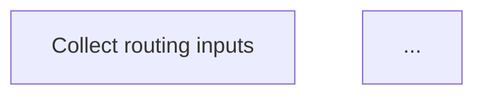
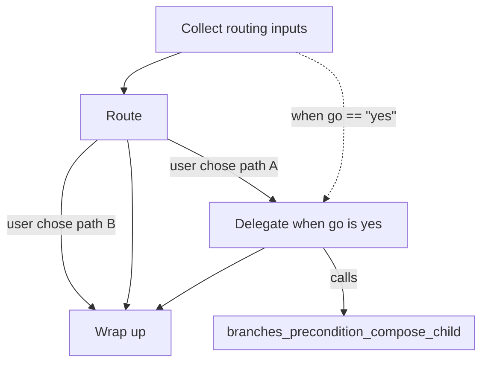

# Workflow Visualization

Generate a Mermaid flowchart of any megálos workflow and embed it in a PR review, a README, or documentation. Static analysis — no runtime, no registry, no side effects. The YAML is the source; the diagram is the view.

## CLI usage

### Standalone diagram

```bash
python -m megalos_server.diagram <workflow.yaml>
```

Writes a Mermaid block to stdout. The first line is always `flowchart TD`, followed by node declarations and edges. Redirect to a file or pipe into your clipboard as you prefer.

### Alongside validation

```bash
python -m megalos_server.validate <workflow.yaml> --diagram
```

Prints `Valid.` and then the Mermaid block. If validation fails, the diagram is suppressed by design — rendering an invalid workflow would be a footgun, since the structure the reader sees would not be the structure the engine accepts.

## Embedding in markdown

GitHub, GitLab, and many static-site generators recognise the `mermaid` fenced-code dialect natively. The renderer emits exactly that fence, so piping the output into a markdown file needs no post-processing:

````markdown

````

Paste into a PR comment, a README, or a docs page and the reader sees the diagram, not the source.

## Worked example

Running `python -m megalos_server.diagram tests/fixtures/workflows/branches_precondition_compose_parent.yaml` on the fixture below produces the diagram that follows. Both are real — the diagram is generated by running the CLI on the fixture verbatim.

### The workflow

Top-level fields: `schema_version: "0.3"`, `name: branches_precondition_compose_parent`, `category: analysis_decision`, `output_format: text`. The `steps:` block:

```yaml
steps:
  - id: step_1
    title: Collect routing inputs
    directive_template: Ask the user for path (A or B) and go (yes or no).
    gates:
      - path captured
      - go captured
    anti_patterns:
      - Guessing path or go
    collect: true
    output_schema:
      type: object
      required: [path, go]
      properties:
        path:
          type: string
          minLength: 1
        go:
          type: string
          minLength: 2

  - id: step_2
    title: Route
    directive_template: Pick a branch based on the user's chosen path.
    gates:
      - branch selected
    anti_patterns:
      - Selecting without asking
    branches:
      - next: p_call
        condition: user chose path A
      - next: p_end
        condition: user chose path B
    default_branch: p_end

  - id: p_call
    title: Delegate when go is yes
    directive_template: Hand off to the child workflow.
    gates:
      - handoff performed
    anti_patterns:
      - Skipping the handoff
    call: branches_precondition_compose_child
    precondition:
      when_equals:
        ref: step_data.step_1.go
        value: "yes"

  - id: p_end
    title: Wrap up
    directive_template: Summarize the chosen path.
    gates:
      - summary written
    anti_patterns:
      - Ignoring the chosen path
```

### The rendered diagram



### What the reader sees

`step_1` collects the routing inputs that both downstream decisions depend on. `step_2` is the branch point: its two labeled edges (`user chose path A`, `user chose path B`) route to `p_call` and `p_end` respectively, and the unlabeled `step_2 --> p_end` edge is the `default_branch` fallback for any non-matching condition — the base dialect pinned by D029.

`p_call` is the compose point. The dotted `step_1 -. "when go == &quot;yes&quot;" .-> p_call` edge is the precondition, drawn from the referenced source (`step_1`) to the gated step per D031. The `p_call -->|"calls"| branches_precondition_compose_child` edge points at the empty `subgraph … end` block per D032, which stands in for the child workflow without attempting to inline its body. `p_end` is the wrap-up. See [`megalos_server/SCHEMA.md`](../megalos_server/SCHEMA.md) for the authoritative grammar behind each construct.

## What the renderer covers

- **Sequential step progression** — `A --> B` linear edges. (D029)
- **Branches** — `A -->|"condition"| B` labeled edges plus an unlabeled `default_branch` fallback edge.
- **`mcp_tool_call` steps** — subroutine shape `id[["label"]]` signals external delegation. (D030)
- **Preconditions** — source-to-gated dotted edge `<source> -. "when <seg> …" .-> <gated>`. (D031)
- **Sub-workflow calls** — empty `subgraph <child>\nend` block with a `|"calls"|` edge from the parent step. (D032)

Cross-reference [`megalos_server/SCHEMA.md`](../megalos_server/SCHEMA.md) for the authoritative schema grammar.

## What is NOT rendered

The renderer emphasises parse-time flow structure. The following constructs are deliberately omitted — each is better understood as a runtime or validation concern than as a visual flow element.

- **Guardrails** (`guardrails:` top-level list) — mechanical runtime triggers, not visual flow.
- **Intermediate artifacts** (`intermediate_artifacts:` per step) — step-level validation checkpoints, not visual flow.
- **`call_context_from:`** — authoring metadata describing which parent data seeds the child; a runtime concern, not visual.

## Authoring loop

Write the YAML, run `python -m megalos_server.validate <file> --diagram` to get both the green check and the diagram in one pass, then paste the Mermaid block into a PR comment or commit it alongside the YAML. M009 pinned the dialect choice (D029) against GitHub's Mermaid renderer via a gist round-trip, so what you see in the PR preview is what reviewers see in the final artifact. For Mermaid syntax questions, see [mermaid.js.org](https://mermaid.js.org).
